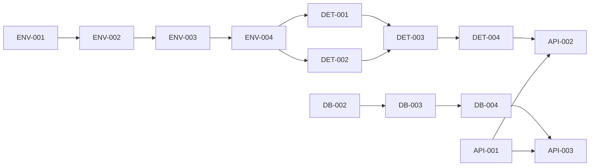

# 🎯 AI任务跟踪器 - Vibe Photos开发任务清单

> 本文档为Coding AI提供结构化的任务清单，便于跟踪进度和管理开发工作

## 📊 任务管理规范

### 任务状态定义
- ⬜ **待开始**: 尚未开始的任务
- 🟨 **进行中**: 正在进行的任务
- ✅ **已完成**: 已完成并验证的任务
- ❌ **已取消**: 因需求变更取消的任务
- 🔄 **需重做**: 需要重新实现的任务

### 优先级定义
- 🔴 **P0-紧急**: 必须立即完成，阻塞其他任务
- 🟠 **P1-高**: 核心功能，本周必须完成
- 🟡 **P2-中**: 重要功能，本阶段需要完成
- 🟢 **P3-低**: 优化类任务，有时间再做

## 📅 Phase 1: MVP开发任务（2周）

### Week 1: 核心功能实现

#### Day 1-2: 项目初始化和环境配置
| 状态 | 优先级 | 任务ID | 任务描述 | 预计时间 | 依赖 | 输出 |
|------|--------|--------|----------|----------|------|------|
| ⬜ | 🔴 P0 | ENV-001 | 初始化项目结构 | 30min | - | 项目目录结构 |
| ⬜ | 🔴 P0 | ENV-002 | 配置pyproject.toml | 30min | ENV-001 | 依赖配置文件 |
| ⬜ | 🔴 P0 | ENV-003 | 安装核心依赖（torch, transformers） | 1h | ENV-002 | 虚拟环境 |
| ⬜ | 🟠 P1 | ENV-004 | 下载AI模型文件 | 2h | ENV-003 | 模型缓存 |
| ⬜ | 🟠 P1 | ENV-005 | 创建配置文件模板 | 30min | ENV-001 | config/settings.yaml |
| ⬜ | 🟡 P2 | ENV-006 | 设置日志系统 | 30min | ENV-001 | src/utils/logger.py |

#### Day 3-4: 核心检测器实现
| 状态 | 优先级 | 任务ID | 任务描述 | 预计时间 | 依赖 | 输出 |
|------|--------|--------|----------|----------|------|------|
| ⬜ | 🔴 P0 | DET-001 | 实现SigLIP模型加载 | 2h | ENV-004 | siglip_model.py |
| ⬜ | 🔴 P0 | DET-002 | 实现BLIP模型加载 | 2h | ENV-004 | blip_model.py |
| ⬜ | 🔴 P0 | DET-003 | 实现基础图像检测器 | 3h | DET-001,DET-002 | detector.py |
| ⬜ | 🟠 P1 | DET-004 | 实现批处理逻辑 | 2h | DET-003 | processor.py |
| ⬜ | 🟠 P1 | DET-005 | 添加缓存机制 | 2h | DET-004 | cache_manager.py |
| ⬜ | 🟡 P2 | DET-006 | 实现性能监控 | 1h | DET-004 | metrics.py |

#### Day 5: 数据层实现
| 状态 | 优先级 | 任务ID | 任务描述 | 预计时间 | 依赖 | 输出 |
|------|--------|--------|----------|----------|------|------|
| ⬜ | 🔴 P0 | DB-001 | 设计数据库schema | 1h | - | 数据模型文档 |
| ⬜ | 🔴 P0 | DB-002 | 实现SQLAlchemy模型 | 2h | DB-001 | database.py |
| ⬜ | 🔴 P0 | DB-003 | 实现CRUD操作 | 2h | DB-002 | 数据库操作方法 |
| ⬜ | 🟠 P1 | DB-004 | 实现搜索功能 | 2h | DB-003 | search方法 |
| ⬜ | 🟠 P1 | DB-005 | 添加数据库索引 | 1h | DB-002 | 优化查询 |
| ⬜ | 🟡 P2 | DB-006 | 实现数据导出 | 1h | DB-003 | export方法 |

### Week 2: API和界面实现

#### Day 6-7: FastAPI接口开发
| 状态 | 优先级 | 任务ID | 任务描述 | 预计时间 | 依赖 | 输出 |
|------|--------|--------|----------|----------|------|------|
| ⬜ | 🔴 P0 | API-001 | 创建FastAPI应用主体 | 1h | DB-003 | main.py |
| ⬜ | 🔴 P0 | API-002 | 实现/import/batch接口 | 2h | DET-004 | 批量导入API |
| ⬜ | 🔴 P0 | API-003 | 实现/search接口 | 2h | DB-004 | 搜索API |
| ⬜ | 🟠 P1 | API-004 | 实现/annotate接口 | 1h | DB-003 | 标注API |
| ⬜ | 🟠 P1 | API-005 | 实现/stats接口 | 1h | DB-003 | 统计API |
| ⬜ | 🟠 P1 | API-006 | 添加API文档 | 1h | API-001 | OpenAPI文档 |
| ⬜ | 🟡 P2 | API-007 | 实现错误处理中间件 | 1h | API-001 | 错误处理 |
| ⬜ | 🟡 P2 | API-008 | 添加请求日志 | 30min | API-001 | 日志中间件 |

#### Day 8-9: CLI和测试
| 状态 | 优先级 | 任务ID | 任务描述 | 预计时间 | 依赖 | 输出 |
|------|--------|--------|----------|----------|------|------|
| ⬜ | 🔴 P0 | CLI-001 | 实现import命令 | 2h | DET-004 | CLI导入功能 |
| ⬜ | 🔴 P0 | CLI-002 | 实现search命令 | 1h | DB-004 | CLI搜索功能 |
| ⬜ | 🟠 P1 | CLI-003 | 实现stats命令 | 1h | DB-003 | CLI统计功能 |
| ⬜ | 🟠 P1 | CLI-004 | 添加进度条显示 | 1h | CLI-001 | 用户体验优化 |
| ⬜ | 🟠 P1 | TEST-001 | 编写检测器测试 | 2h | DET-003 | test_detector.py |
| ⬜ | 🟠 P1 | TEST-002 | 编写数据库测试 | 2h | DB-003 | test_database.py |
| ⬜ | 🟡 P2 | TEST-003 | 编写API测试 | 2h | API-003 | test_api.py |
| ⬜ | 🟡 P2 | TEST-004 | 性能基准测试 | 1h | DET-004 | benchmark.py |

#### Day 10: 集成和优化
| 状态 | 优先级 | 任务ID | 任务描述 | 预计时间 | 依赖 | 输出 |
|------|--------|--------|----------|----------|------|------|
| ⬜ | 🔴 P0 | INT-001 | 端到端测试 | 2h | ALL | 集成测试 |
| ⬜ | 🔴 P0 | INT-002 | 修复发现的bug | 3h | INT-001 | Bug修复 |
| ⬜ | 🟠 P1 | INT-003 | 性能优化 | 2h | INT-001 | 性能提升 |
| ⬜ | 🟠 P1 | DOC-001 | 编写README | 1h | INT-002 | 文档 |
| ⬜ | 🟡 P2 | DOC-002 | 编写API文档 | 1h | API-006 | API说明 |
| ⬜ | 🟡 P2 | DOC-003 | 创建示例代码 | 1h | INT-002 | examples/ |

## 📅 Phase 2: 语义搜索增强（1个月）

### Week 3-4: 向量嵌入实现
| 状态 | 优先级 | 任务ID | 任务描述 | 预计时间 | 依赖 | 输出 |
|------|--------|--------|----------|----------|------|------|
| ⬜ | 🔴 P0 | EMB-001 | 实现图像向量编码 | 3h | Phase1 | embedder.py |
| ⬜ | 🔴 P0 | EMB-002 | 实现文本向量编码 | 2h | EMB-001 | 文本编码 |
| ⬜ | 🔴 P0 | EMB-003 | 实现相似度计算 | 1h | EMB-001 | 相似度函数 |
| ⬜ | 🟠 P1 | EMB-004 | 向量存储到数据库 | 2h | EMB-001 | 数据库更新 |
| ⬜ | 🟠 P1 | EMB-005 | 批量向量处理 | 2h | EMB-004 | 批处理优化 |
| ⬜ | 🟡 P2 | EMB-006 | 向量缓存机制 | 2h | EMB-004 | 缓存优化 |

### Week 5-6: 混合搜索实现
| 状态 | 优先级 | 任务ID | 任务描述 | 预计时间 | 依赖 | 输出 |
|------|--------|--------|----------|----------|------|------|
| ⬜ | 🔴 P0 | SRCH-001 | 实现向量搜索 | 3h | EMB-003 | vector_search |
| ⬜ | 🔴 P0 | SRCH-002 | 实现混合搜索 | 4h | SRCH-001 | hybrid_search |
| ⬜ | 🟠 P1 | SRCH-003 | 实现结果融合算法 | 2h | SRCH-002 | merge算法 |
| ⬜ | 🟠 P1 | SRCH-004 | 搜索性能优化 | 3h | SRCH-002 | 优化 |
| ⬜ | 🟡 P2 | SRCH-005 | 添加搜索日志 | 1h | SRCH-002 | 日志分析 |

## 📅 Phase 3: 生产级系统（3个月）

### Month 1: 基础设施升级
| 状态 | 优先级 | 任务ID | 任务描述 | 预计时间 | 依赖 | 输出 |
|------|--------|--------|----------|----------|------|------|
| ⬜ | 🔴 P0 | PROD-001 | PostgreSQL环境搭建 | 4h | - | 数据库环境 |
| ⬜ | 🔴 P0 | PROD-002 | pgvector配置 | 2h | PROD-001 | 向量支持 |
| ⬜ | 🔴 P0 | PROD-003 | 数据迁移脚本 | 4h | PROD-002 | 迁移工具 |
| ⬜ | 🟠 P1 | PROD-004 | Redis缓存集成 | 3h | PROD-001 | 缓存层 |
| ⬜ | 🟠 P1 | PROD-005 | Celery任务队列 | 4h | PROD-004 | 异步处理 |
| ⬜ | 🟡 P2 | PROD-006 | 监控系统搭建 | 4h | PROD-005 | Prometheus |

### Month 2: 高级功能开发
| 状态 | 优先级 | 任务ID | 任务描述 | 预计时间 | 依赖 | 输出 |
|------|--------|--------|----------|----------|------|------|
| ⬜ | 🔴 P0 | ADV-001 | RRF搜索算法 | 4h | PROD-002 | 高级搜索 |
| ⬜ | 🟠 P1 | ADV-002 | Few-shot学习 | 8h | ADV-001 | 学习系统 |
| ⬜ | 🟠 P1 | ADV-003 | 用户偏好学习 | 6h | ADV-002 | 个性化 |
| ⬜ | 🟡 P2 | ADV-004 | 批量标注工具 | 4h | ADV-001 | 标注优化 |
| ⬜ | 🟡 P2 | ADV-005 | 高级过滤器 | 3h | ADV-001 | 过滤功能 |

### Month 3: 部署和优化
| 状态 | 优先级 | 任务ID | 任务描述 | 预计时间 | 依赖 | 输出 |
|------|--------|--------|----------|----------|------|------|
| ⬜ | 🔴 P0 | DEPL-001 | Docker镜像构建 | 3h | ADV-001 | Dockerfile |
| ⬜ | 🔴 P0 | DEPL-002 | CI/CD配置 | 4h | DEPL-001 | GitHub Actions |
| ⬜ | 🟠 P1 | DEPL-003 | 负载测试 | 4h | DEPL-001 | 性能报告 |
| ⬜ | 🟠 P1 | DEPL-004 | 安全审计 | 3h | DEPL-001 | 安全报告 |
| ⬜ | 🟡 P2 | DEPL-005 | 文档完善 | 4h | DEPL-002 | 完整文档 |
| ⬜ | 🟡 P2 | DEPL-006 | 培训材料 | 3h | DEPL-005 | 培训文档 |

## 📈 任务执行指南

### 任务执行顺序规则
1. **先P0后P1**: 始终先完成P0任务
2. **依赖优先**: 有依赖的任务必须等待依赖完成
3. **并行执行**: 无依赖关系的任务可并行
4. **测试驱动**: 先写测试，再写实现
5. **持续集成**: 每完成一个模块就集成测试

### 任务完成标准
```yaml
代码完成:
  - 功能实现完整
  - 类型注解完整
  - 错误处理完善
  - 日志记录充分

测试完成:
  - 单元测试通过
  - 集成测试通过
  - 测试覆盖>80%
  - 性能达标

文档完成:
  - 代码注释清晰
  - API文档更新
  - README更新
  - 示例代码可运行
```

### 任务评估模板
```markdown
## 任务ID: XXX-000
### 完成情况
- 实现功能: ✅/❌
- 编写测试: ✅/❌
- 更新文档: ✅/❌
- 代码审查: ✅/❌

### 性能指标
- 执行时间: Xms
- 内存占用: XMB
- 测试覆盖: X%

### 问题和风险
- 问题1: 描述
- 风险1: 描述

### 下一步
- 后续任务1
- 优化方向1
```

## 🔄 任务状态汇总

### Phase 1 进度
```
总任务数: 46
⬜ 待开始: 46 (100%)
🟨 进行中: 0 (0%)
✅ 已完成: 0 (0%)
❌ 已取消: 0 (0%)

优先级分布:
🔴 P0: 18个
🟠 P1: 18个
🟡 P2: 10个
🟢 P3: 0个
```

### 关键路径任务


## 🎯 每日任务建议

### Day 1 建议任务列表
```
上午（4小时）:
1. ENV-001: 初始化项目结构 (30min)
2. ENV-002: 配置pyproject.toml (30min)
3. ENV-003: 安装核心依赖 (1h)
4. ENV-004: 下载AI模型文件 (2h)

下午（4小时）:
1. ENV-005: 创建配置文件模板 (30min)
2. ENV-006: 设置日志系统 (30min)
3. DET-001: 实现SigLIP模型加载 (2h)
4. 编写DET-001的单元测试 (1h)

预期完成: 6个任务
```

### 任务并行建议
```
可并行任务组:
- Group 1: [DET-001, DET-002] - 模型加载可并行
- Group 2: [DB-002, ENV-005, ENV-006] - 无依赖关系
- Group 3: [API-002, API-003, API-004] - 不同接口可并行开发
- Group 4: [TEST-001, TEST-002, TEST-003] - 测试可并行编写
```

## 💡 AI执行提示

### 任务开始前检查
```python
def before_task_checklist(task_id: str):
    """任务开始前的检查清单"""
    checklist = {
        "dependencies_ready": check_dependencies(task_id),
        "environment_ready": check_environment(),
        "tests_planned": plan_tests(task_id),
        "time_allocated": estimate_time(task_id),
        "output_defined": define_outputs(task_id)
    }
    return all(checklist.values())
```

### 任务完成后验证
```python
def after_task_validation(task_id: str):
    """任务完成后的验证"""
    validation = {
        "code_complete": verify_implementation(),
        "tests_passing": run_tests(),
        "docs_updated": check_documentation(),
        "performance_ok": check_performance(),
        "no_regressions": run_regression_tests()
    }
    return all(validation.values())
```

### 任务切换策略
1. **完成当前任务**: 不要半途切换
2. **提交代码**: 每个任务完成后提交
3. **运行测试**: 确保不破坏已有功能
4. **更新文档**: 及时记录变更
5. **标记完成**: 更新任务状态

## 📊 风险管理矩阵

| 风险类别 | 风险描述 | 概率 | 影响 | 缓解措施 |
|----------|----------|------|------|----------|
| 技术风险 | 模型加载失败 | 中 | 高 | 提供离线模型下载方案 |
| 技术风险 | 内存溢出 | 中 | 高 | 实现批处理和内存管理 |
| 进度风险 | 任务延期 | 高 | 中 | 保持最小功能集，渐进增强 |
| 质量风险 | 测试不足 | 中 | 高 | 强制TDD，自动化测试 |
| 依赖风险 | 包版本冲突 | 低 | 中 | 使用uv锁定版本 |

## 🏁 里程碑和交付物

### Phase 1 里程碑
- **M1 (Day 5)**: 核心检测功能完成
  - 交付物: 可运行的检测器，测试报告
- **M2 (Day 10)**: MVP系统完成
  - 交付物: 完整API，CLI工具，文档

### Phase 2 里程碑
- **M3 (Week 4)**: 向量搜索实现
  - 交付物: 向量搜索API，性能报告
- **M4 (Week 6)**: 混合搜索完成
  - 交付物: 增强搜索系统，A/B测试结果

### Phase 3 里程碑
- **M5 (Month 1)**: 基础设施升级
  - 交付物: PostgreSQL系统，迁移工具
- **M6 (Month 2)**: 高级功能完成
  - 交付物: Few-shot学习，个性化系统
- **M7 (Month 3)**: 生产部署
  - 交付物: Docker镜像，部署文档，运维手册

---

## 📝 使用说明

### 给Coding AI的使用指南

1. **查看当前任务**
   - 找到状态为⬜的最高优先级任务
   - 检查其依赖是否已完成
   - 评估预计时间

2. **开始任务**
   - 将状态从⬜改为🟨
   - 记录开始时间
   - 创建相应的代码文件

3. **完成任务**
   - 运行测试确保通过
   - 将状态从🟨改为✅
   - 记录实际用时
   - 更新相关文档

4. **遇到问题**
   - 记录在"问题和风险"部分
   - 如果阻塞，标记任务为🔄
   - 寻找可并行的其他任务

5. **每日总结**
   - 统计完成的任务数
   - 更新进度百分比
   - 计划第二天的任务

### 任务优先级决策树
```
是否有P0任务未完成？
  是 → 执行P0任务
  否 → 是否有P1任务未完成？
    是 → 执行P1任务
    否 → 是否有P2任务未完成？
      是 → 执行P2任务
      否 → 执行P3任务或优化
```

---

**文档版本**: 1.0.0
**最后更新**: 2024-11-12
**用途**: AI开发任务管理
**更新频率**: 每日更新任务状态
