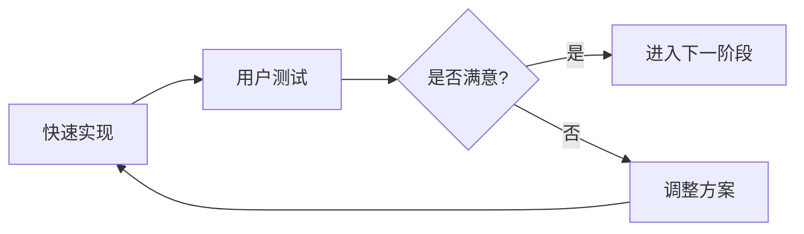

# 📋 POC阶段重要说明

## 🎯 当前状态
**项目阶段**: POC (Proof of Concept) - 概念验证阶段  
**当前进度**: Phase 1 准备就绪  
**更新时间**: 2025年11月13日  

## ⚠️ POC阶段核心原则

### 1. 快速验证优先
- **目标**: 验证技术可行性，而非生产部署
- **重点**: 功能实现 > 代码质量 > 性能优化
- **原则**: 能跑就行，先跑通再优化

### 2. 无兼容性约束
- **破坏性变更**: 随时可能重构整个架构
- **无版本迁移**: 不保证版本间兼容性
- **数据重置**: 每个阶段可完全清空重来
  ```bash
  # 快速重置，无需担心数据丢失
  rm -rf data/* cache/* log/* tmp/*
  ```

### 3. 灵活迭代
- **目录结构**: 可根据需要随时调整
- **技术选型**: 可根据验证结果更换
- **功能范围**: 可根据进展动态调整

## 📁 POC阶段目录策略

### 可破坏性目录
```
data/       # 随时可清空，无需备份
cache/      # 可选择性保留，不是必须
log/        # 调试信息，可随时删除
tmp/        # 临时文件，随时可清理
```

### 重要但可复用目录
```
models/     # 预训练模型，首次下载后保留（约430MB）
```

### 受保护目录
```
samples/    # 原始测试数据，只读不改
blueprints/ # 设计文档，版本控制
```

## 🚀 POC各阶段目标

### Phase 1 (当前)
- **时间**: 2周
- **目标**: 验证核心检测能力
- **产出**: 技术可行性报告
- **决策点**: 是否继续投入

### Phase 2 (计划中)
- **时间**: 1个月
- **目标**: 验证语义搜索能力
- **产出**: 用户体验原型
- **决策点**: 产品形态确认

### Phase 3 (远期)
- **时间**: 2-3个月
- **目标**: 生产级系统设计
- **产出**: 可部署的MVP
- **决策点**: 是否正式产品化

## ✅ POC阶段优势

1. **快速试错**
   - 2周内得出结论
   - 最小化沉没成本
   - 快速调整方向

2. **技术探索**
   - 尝试不同方案
   - 验证性能边界
   - 发现潜在问题

3. **需求明确**
   - 通过原型获得反馈
   - 迭代产品定义
   - 确认核心价值

## ⚡ 快速开始

```bash
# 1. 设置环境（5分钟）
cd blueprints/phase1
uv venv --python 3.12
source .venv/bin/activate
uv pip sync requirements.txt

# 2. 预下载模型（首次运行，10分钟）
uv run python download_models.py

# 3. 处理数据（30分钟）
uv run python process_dataset.py

# 4. 查看结果（立即）
uv run python quick_start.py
```

## 📊 成功标准

### Phase 1 成功标准
- [ ] SigLIP分类准确率 > 80%
- [ ] BLIP描述生成质量良好
- [ ] 处理速度 > 10张/分钟
- [ ] 缓存机制正常工作
- [ ] 用户反馈积极

### 不追求的目标
- ❌ 100%代码覆盖率
- ❌ 完美的错误处理
- ❌ 生产级性能
- ❌ 完整的文档

## 🔄 迭代流程



## 💡 开发建议

1. **不要过度设计**
   - 够用就好
   - 先跑通再优化
   - 避免过早抽象

2. **快速获得反馈**
   - 每日展示进展
   - 及时调整方向
   - 保持沟通

3. **记录关键决策**
   - 为什么选择这个方案
   - 有哪些备选方案
   - 遇到什么问题

## 📝 注意事项

1. **数据安全**
   - samples/ 目录只读
   - 不要修改原始数据
   - 测试数据不要外泄

2. **代码管理**
   - POC代码可以粗糙
   - 但要能运行
   - 关键逻辑要注释

3. **期望管理**
   - POC != 生产代码
   - 重点在验证想法
   - 不是最终产品

## 🎯 当前行动

**立即执行**: 运行 Phase 1，2周内完成验证

**关键问题**:
1. SigLIP+BLIP能否满足识别需求？
2. 多语言支持效果如何？
3. 处理3万张照片需要多久？
3. 用户对检测结果是否满意？

**决策时间**: 2周后评估是否进入 Phase 2

---

**记住**: POC阶段就是要快、要灵活、要敢于试错！

*不要追求完美，追求答案。*
