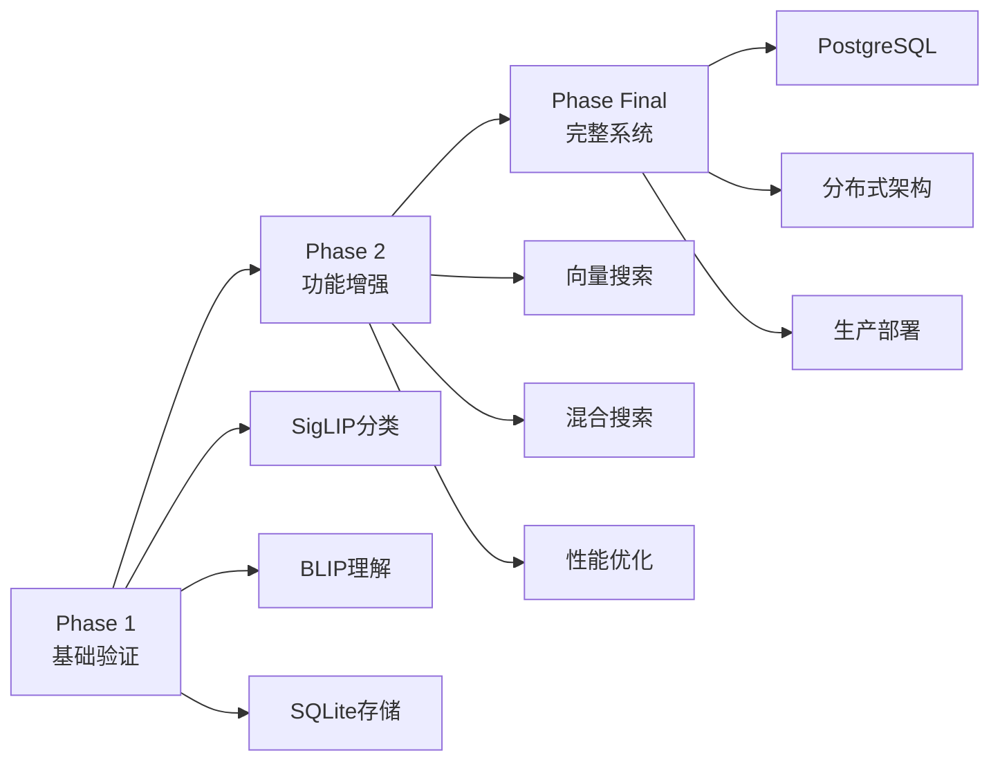

# 📁 Blueprints - 项目蓝图目录

> 📋 本目录包含项目各个阶段的设计文档和技术蓝图

## 🤖 For Coding AI
**主要文档**: [AI_BLUEPRINT_GUIDE.md](./AI_BLUEPRINT_GUIDE.md) - 结构化的技术实施方案，包含架构设计、模块定义和实现细节

## 📁 目录结构

```
blueprints/
├── phase1/          # 第一阶段：基础验证（原Phase 1）
├── phase2/          # 第二阶段：功能增强（原Phase 2，待实施）
└── phase_final/     # 最终阶段：完整系统（原Phase Final）
```

## 🚀 项目阶段

### Phase 1 - 基础验证 ✅
**目标**：验证核心技术可行性
- **重点**：SigLIP多语言分类、BLIP图像理解
- **规模**：1,000张测试照片
- **文档**：[phase1/README.md](./phase1/README.md)

### Phase 2 - 功能增强 🚧
**目标**：完善核心功能
- **重点**：向量搜索、语义理解
- **规模**：5,000张照片
- **状态**：待实施

### Phase Final - 完整系统 📋
**目标**：生产级系统
- **重点**：完整功能、性能优化、可扩展架构
- **规模**：30,000+张照片
- **技术栈**：PostgreSQL + pgvector、Celery + Redis、FastAPI
- **文档**：[phase_final/README.md](./phase_final/README.md)

## 🎯 统一术语说明

为保持文档一致性，我们统一使用以下术语：

| 原术语 | 新术语 | 说明 |
|--------|--------|------|
| Phase 1 | Phase 1 | 第一阶段：基础验证 |
| Phase 2 | Phase 2 | 第二阶段：功能增强 |
| Phase Final | Phase Final | 最终阶段：完整系统 |

## 📌 开发路线



## ⭐ 快速开始

### 1. 了解技术决策
查看 [decisions/TECHNICAL_DECISIONS.md](../decisions/TECHNICAL_DECISIONS.md)

### 2. 查看系统架构
阅读 [phase_final/architecture/system_architecture.md](./phase_final/architecture/system_architecture.md)

### 3. 开始实施
参考 [phase_final/docs/04_implementation_guide.md](./phase_final/docs/04_implementation_guide.md)

## 📊 技术栈演进

| 组件 | Phase 1 | Phase 2 | Phase Final |
|------|---------|---------|-------------|
| **数据库** | SQLite | SQLite + JSON | PostgreSQL + pgvector |
| **向量搜索** | - | NumPy | pgvector (HNSW索引) |
| **任务队列** | - | Python Queue | Celery + Redis |
| **API** | CLI | FastAPI (基础) | FastAPI (完整) |
| **模型** | SigLIP+BLIP基础 | + GroundingDINO | + PaddleOCR + DINOv2 |

## 📝 文档维护

- **决策记录**：重要技术决策记录在 ../decisions/TECHNICAL_DECISIONS.md
- **调研归档**：技术调研内容归档在 phase_final/research/
- **术语统一**：使用 Phase 1/2/Final 替代 Phase 1/Phase 2/Phase Final

## ✅ 当前状态

- Phase 1：已完成设计 ✅
- Phase 2：规划中 🚧
- Phase Final：架构设计完成，待实施 📋

---

*最后更新：2024年11月*
*维护者：Vibe Photos Team*
