# 系统架构设计 - Vibe Photos Phase Final

## 🏗 整体架构

### 分层架构图
```
┌──────────────────────────────────────────────────────┐
│                   用户接口层                          │
│  ┌─────────┐  ┌──────────┐  ┌──────────┐  ┌──────┐  │
│  │   CLI   │  │  Web UI  │  │   API    │  │ SDK  │  │
│  └─────────┘  └──────────┘  └──────────┘  └──────┘  │
└──────────────────────────────────────────────────────┘
                           │
┌──────────────────────────────────────────────────────┐
│                   应用服务层                          │
│  ┌──────────────────────────────────────────────┐   │
│  │            FastAPI Application              │   │
│  ├──────────┬──────────┬──────────┬───────────┤   │
│  │  Router  │ Middle-  │  Deps    │  Schemas  │   │
│  │          │  ware    │          │           │   │
│  └──────────┴──────────┴──────────┴───────────┘   │
└──────────────────────────────────────────────────────┘
                           │
┌──────────────────────────────────────────────────────┐
│                   业务逻辑层                          │
│  ┌──────────┬──────────┬──────────┬──────────┐     │
│  │ Detector │Annotator │ Searcher │ Learner  │     │
│  ├──────────┼──────────┼──────────┼──────────┤     │
│  │   OCR    │ Tagger   │  Filter  │ Few-Shot │     │
│  └──────────┴──────────┴──────────┴──────────┘     │
└──────────────────────────────────────────────────────┘
                           │
┌──────────────────────────────────────────────────────┐
│                    AI模型层                           │
│  ┌──────────┬──────────┬──────────┬──────────┐     │
│  │  SigLIP  │   BLIP   │ PaddleOCR│  DINOv2  │     │
│  └──────────┴──────────┴──────────┴──────────┘     │
└──────────────────────────────────────────────────────┘
                           │
┌──────────────────────────────────────────────────────┐
│                   数据访问层                          │
│  ┌──────────┬──────────┬──────────┬──────────┐     │
│  │  SQLite  │  Faiss   │FileSystem│  Cache   │     │
│  └──────────┴──────────┴──────────┴──────────┘     │
└──────────────────────────────────────────────────────┘
```

## 🔄 核心流程

### 1. 照片导入流程（含Celery实现）

```mermaid
sequenceDiagram
    participant User
    participant FastAPI
    participant Celery
    participant Redis
    participant Worker
    participant DB

    User->>FastAPI: POST /import/batch
    FastAPI->>Celery: create_task(process_batch)
    Celery->>Redis: enqueue(task_id, priority=5)
    FastAPI-->>User: task_id (immediate response)
    
    Note over Redis,Worker: 异步处理
    Worker->>Redis: fetch_task()
    Worker->>Worker: detect & classify
    
    alt confidence > 0.8
        Worker->>DB: save(auto_labeled)
    else confidence < 0.5
        Worker->>Redis: add_to_queue('review')
    else
        Worker->>DB: save(with_suggestion)
    end
    
    Worker->>Redis: publish(task_id, 'complete')
    Redis-->>User: WebSocket notification
```


### 2. 智能识别流程

```mermaid
graph TB
    A[输入图片] --> B{检测类型}
    
    B -->|电子产品| C[品牌识别]
    B -->|文档/截图| D[OCR提取]
    B -->|美食| E[菜品识别]
    B -->|未知| F[通用分类]
    
    C --> G[型号检测]
    D --> H[文字分析]
    E --> I[食材标注]
    F --> J[人工队列]
    
    G --> K[合并结果]
    H --> K
    I --> K
    J --> K
    
    K --> L[保存到数据库]
```


### 3. 学习进化流程（含版本管理）

```mermaid
graph LR
    A[用户标注] --> B[收集样本]
    B --> C{样本数量}
    
    C -->|>5| D[训练Few-shot]
    C -->|>20| E[微调模型]
    C -->|>100| F[重训练]
    
    D --> G[版本注册 v1.x.x]
    E --> G
    F --> G
    
    G --> H[A/B测试]
    H --> I{性能对比}
    
    I -->|优于旧版| J[蓝绿部署]
    I -->|相当| K[金丝雀发布]
    I -->|较差| L[回滚]
    
    J --> M[更新向量索引]
    K --> M
```


## 🎯 模块设计

### 核心模块

#### 1. Detector（检测器）
```python
class DetectorModule:
    """
    负责图像内容识别
    """
    components = {
        'general': SigLIPDetector,     # 通用分类（多语言）
        'captioning': BLIPCaptioner,   # 图像描述生成
        'object': GroundingDINO,       # 物体检测（可选）
        'text': PaddleOCR,             # 文字提取
        'brand': BrandRecognizer,      # 品牌识别
    }
    
    def detect(self, image: Image) -> DetectionResult:
        results = []
        for component in self.active_components:
            result = component.process(image)
            results.append(result)
        return self.merge_results(results)
```

#### 2. Annotator（标注器）
```python
class AnnotatorModule:
    """
    处理人工标注和自动标注
    """
    features = {
        'auto_suggest': True,      # AI建议
        'batch_apply': True,       # 批量应用
        'similarity_group': True,  # 相似分组
        'keyboard_shortcuts': True # 快捷键
    }
    
    def annotate(self, image: Image, user_input: str = None):
        if user_input:
            self.save_annotation(image, user_input)
            self.learn_from_annotation(image, user_input)
        else:
            return self.generate_suggestions(image)
```

#### 3. Searcher（搜索器）
```python
class SearcherModule:
    """
    多模态搜索引擎
    """
    strategies = {
        'text': TextSearch,        # 文本搜索
        'vector': VectorSearch,    # 向量搜索
        'hybrid': HybridSearch,    # 混合搜索
        'filter': FilterSearch     # 过滤搜索
    }
    
    def search(self, query: str, filters: Dict = None):
        # 解析查询意图
        intent = self.parse_query(query)
        
        # 选择搜索策略
        strategy = self.select_strategy(intent)
        
        # 执行搜索
        results = strategy.search(query, filters)
        
        # 排序和返回
        return self.rank_results(results)
```

#### 4. Learner（学习器）
```python
class LearnerModule:
    """
    Few-shot和增量学习
    """
    models = {
        'few_shot': FewShotLearner,
        'fine_tune': FineTuner,
        'incremental': IncrementalLearner
    }
    
    def learn(self, samples: List[LabeledImage]):
        if len(samples) < 5:
            return "需要更多样本"
        elif len(samples) < 20:
            return self.few_shot_learn(samples)
        else:
            return self.fine_tune(samples)
```

## 💾 数据模型

### 数据库架构
```sql
-- 核心表
CREATE TABLE photos (
    id INTEGER PRIMARY KEY,
    path TEXT UNIQUE NOT NULL,
    hash TEXT,
    
    -- 元数据
    width INTEGER,
    height INTEGER,
    size INTEGER,
    taken_at TIMESTAMP,
    imported_at TIMESTAMP DEFAULT CURRENT_TIMESTAMP,
    
    -- AI结果
    category TEXT,
    confidence REAL,
    detections JSON,  -- [{class, bbox, score}]
    ocr_text TEXT,
    
    -- 用户数据
    user_label TEXT,
    user_tags TEXT,
    is_favorite BOOLEAN DEFAULT FALSE,
    
    -- 向量
    embedding BLOB  -- 序列化的向量
);

-- 标注历史
CREATE TABLE annotations (
    id INTEGER PRIMARY KEY,
    photo_id INTEGER REFERENCES photos(id),
    
    ai_prediction TEXT,
    user_label TEXT,
    confidence REAL,
    
    created_at TIMESTAMP DEFAULT CURRENT_TIMESTAMP,
    used_for_training BOOLEAN DEFAULT FALSE
);

-- 自定义模型
CREATE TABLE custom_models (
    id INTEGER PRIMARY KEY,
    name TEXT UNIQUE,
    
    model_type TEXT,  -- few_shot, fine_tuned
    samples_count INTEGER,
    accuracy REAL,
    
    model_path TEXT,
    created_at TIMESTAMP DEFAULT CURRENT_TIMESTAMP,
    updated_at TIMESTAMP
);

-- 搜索索引
CREATE INDEX idx_category ON photos(category);
CREATE INDEX idx_confidence ON photos(confidence);
CREATE INDEX idx_user_label ON photos(user_label);
CREATE INDEX idx_taken_at ON photos(taken_at);
```

## 🔧 技术栈映射

### 组件技术选择（已更新）
```yaml
presentation:
  cli: typer + rich
  web: gradio → react
  api: fastapi
  
business:
  detector: transformers + custom
  annotator: python core
  searcher: whoosh → elasticsearch
  learner: pytorch + few-shot
  queue: celery + redis  # ✅ 已补充任务队列方案
  
models:
  vision: siglip, blip  # SigLIP多语言支持，BLIP图像理解
  ocr: paddleocr
  embeddings: sentence-transformers
  optional: groundingdino  # 开放词汇检测（可选）
  
data:
  database: sqlite → postgresql + pgvector  # ✅ 统一存储方案
  vectors: pgvector (primary)  # ✅ 简化架构，足够3万张照片
  vectors_optional: faiss  # 仅当超过百万向量时考虑
  cache: diskcache → redis
  files: local → s3-compatible
  
infrastructure:
  task_queue: celery  # ✅ 任务编排
  message_broker: redis  # ✅ 消息队列
  monitoring: prometheus + grafana
  model_registry: postgresql  # ✅ 模型版本管理
```

### 详细技术方案文档
- 📬 [消息队列与任务编排](./queue_and_task_management.md)
- 🗂 [向量数据库与模型版本管理](./vector_db_and_model_versioning.md)

## 🚀 部署架构

### 单机部署（MVP）
```
┌──────────────────────────────┐
│         单一进程              │
│  ┌──────────────────────┐    │
│  │   Uvicorn Server     │    │
│  │   (FastAPI App)      │    │
│  └──────────────────────┘    │
│           ↓                   │
│  ┌──────────────────────┐    │
│  │   SQLite + Local FS  │    │
│  └──────────────────────┘    │
└──────────────────────────────┘
```

### 生产部署（目标）
```
┌─────────────────────────────────────┐
│           负载均衡器                 │
└─────────────────────────────────────┘
            ↓         ↓
┌──────────────┐  ┌──────────────┐
│   API服务器1  │  │   API服务器2  │
└──────────────┘  └──────────────┘
            ↓         ↓
┌─────────────────────────────────────┐
│          共享存储层                  │
│   PostgreSQL │ Redis │ MinIO        │
└─────────────────────────────────────┘
```

## 📊 性能设计

### 缓存策略
```python
cache_hierarchy = {
    'L1_memory': {
        'size': '100MB',
        'ttl': 300,  # 5分钟
        'content': ['hot_queries', 'user_session']
    },
    'L2_disk': {
        'size': '1GB',
        'ttl': 3600,  # 1小时
        'content': ['thumbnails', 'predictions']
    },
    'L3_distributed': {
        'size': 'unlimited',
        'ttl': 86400,  # 1天
        'content': ['search_results', 'model_cache']
    }
}
```

### 并发处理
```python
concurrency_config = {
    'web_workers': 4,           # Uvicorn workers
    'batch_size': 16,           # GPU batch
    'db_pool_size': 20,         # 连接池
    'async_tasks': 100,         # 异步任务上限
    'rate_limit': '100/minute'  # API限流
}
```

## 🔐 安全设计

### 安全层次
```
1. 网络层：HTTPS、防火墙
2. 应用层：认证、授权、输入验证
3. 数据层：加密、脱敏、备份
4. 审计层：日志、监控、告警
```

### 隐私保护
```python
privacy_features = {
    'face_blur': True,          # 人脸模糊
    'text_redaction': True,     # 敏感文字脱敏
    'local_only': True,         # 纯本地处理
    'no_tracking': True         # 无追踪
}
```

## 📈 扩展性设计

### 水平扩展路径
```
阶段1: 单机 (< 10万照片)
阶段2: 主从 (< 100万照片)  
阶段3: 分片 (< 1000万照片)
阶段4: 分布式 (无限扩展)
```

### 插件架构
```python
plugin_system = {
    'detectors': [],      # 自定义检测器
    'processors': [],     # 图像处理器
    'exporters': [],      # 导出格式
    'importers': []       # 导入源
}
```

## ✅ 架构原则

1. **简单优先** - 不过度设计
2. **渐进增强** - 可平滑升级
3. **模块解耦** - 独立演进
4. **数据驱动** - 决策有据可依
5. **用户中心** - 体验至上

---

这个架构设计为Phase Final提供了清晰的技术蓝图，既保持了简单性，又预留了扩展空间。
