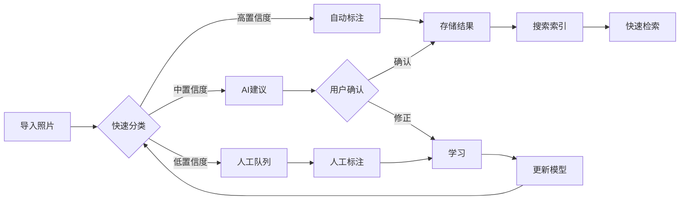

# 解决方案设计 - Vibe Photos Phase Final

## 🎯 设计理念

### 核心思想：AI辅助的渐进式智能系统

```
初始状态          用户参与          系统进化
    ↓                ↓                ↓
基础AI识别  →  人工标注优化  →  个性化学习
 (70-80%)      (+10-15%)        (最终95%+)
```

## 🏗 系统架构

### 三层架构设计

```
┌─────────────────────────────────────────────┐
│           Presentation Layer                 │
│   CLI / Web UI / API / Gradio Interface     │
└─────────────────────────────────────────────┘
                      ↕
┌─────────────────────────────────────────────┐
│            Business Logic Layer              │
│  Detection │ Annotation │ Search │ Learning │
└─────────────────────────────────────────────┘
                      ↕
┌─────────────────────────────────────────────┐
│              Data Layer                      │
│   SQLite │ Vector DB │ File System │ Cache  │
└─────────────────────────────────────────────┘
```

## 🔄 核心工作流

### 1. 智能导入流程

```python
def smart_import_workflow(photo_path):
    """
    渐进式处理，快速反馈
    """
    # Step 1: 快速预览（1秒）
    thumbnail = generate_thumbnail(photo_path)
    
    # Step 2: 基础分类（2秒）
    category = quick_classify(thumbnail)  # 电子产品/美食/文档
    
    # Step 3: 深度分析（异步，3-5秒）
    async_tasks.add({
        'detect_objects': detect_specific_items,
        'extract_text': ocr_if_needed,
        'find_brand': identify_brand_if_electronic,
        'compute_embedding': generate_search_vector
    })
    
    # Step 4: 智能决策
    if confidence < 0.5:
        add_to_review_queue(photo_path)
    
    return initial_result  # 立即返回，深度结果后台更新
```

### 2. 混合识别策略

```python
class HybridRecognizer:
    """
    多层次识别，逐步精确
    """
    
    def recognize(self, image):
        # Layer 1: 高置信度大类
        general = self.general_classifier(image)
        # Output: "电子产品" (90% sure)
        
        # Layer 2: 中置信度子类
        if general == "电子产品":
            subtype = self.electronic_classifier(image)
            # Output: "手机" (70% sure)
            
        # Layer 3: 低置信度/需要帮助
        if subtype == "手机":
            brand = self.try_brand_detection(image)
            # Output: "可能是iPhone" (40% sure) → 需要人工
            
        # Layer 4: 用户专属识别器
        if self.has_user_model(image):
            custom = self.user_specific_model(image)
            # Output: "iPhone 15 Pro Max 钛金属" (95% sure)
        
        return self.merge_results()
```

### 3. 智能标注助手

```python
class AnnotationAssistant:
    """
    减少80%的标注工作量
    """
    
    def assist_annotation(self, image):
        # 1. AI预测
        predictions = self.predict(image)
        
        # 2. 相似图片
        similar = self.find_similar_in_db(image)
        
        # 3. 智能建议
        suggestions = {
            'most_likely': predictions[0],
            'from_similar': similar[0].label if similar else None,
            'from_ocr': self.extract_text(image),
            'from_history': self.predict_from_user_pattern(),
        }
        
        # 4. 快速操作
        return {
            'auto_apply': confidence > 0.95,
            'suggestions': suggestions,
            'batch_apply': self.find_identical_images(image),
            'keyboard_shortcuts': self.generate_shortcuts()
        }
```

### 4. Few-Shot学习系统

```python
class FewShotLearner:
    """
    5-10个样本学会新产品
    """
    
    def learn_new_product(self, product_name, sample_images):
        # 1. 特征提取（使用DINOv2）
        features = [self.extract_features(img) for img in sample_images]
        
        # 2. 创建原型
        prototype = self.create_prototype(features)
        
        # 3. 注册分类器
        self.custom_classifiers[product_name] = {
            'prototype': prototype,
            'threshold': self.calculate_threshold(features),
            'samples': len(sample_images),
            'created': datetime.now()
        }
        
        # 4. 立即可用
        return self.test_on_validation_set(product_name)
```

## 💡 关键创新点

### 1. 渐进式处理
- **即时反馈**：1秒内显示缩略图和初步分类
- **后台深化**：异步进行复杂分析
- **智能队列**：优先处理重要/常用类别

### 2. 置信度驱动
```python
confidence_actions = {
    0.95: "自动应用",
    0.80: "建议确认",
    0.60: "提供选项",
    0.40: "请求帮助",
    0.20: "标记未知"
}
```

### 3. 批量优化
- **相似分组**：自动发现相似图片
- **一键应用**：标注一张，应用到组
- **智能采样**：只标注代表性图片

### 4. 个性化学习
- **用户模式学习**：记住标注习惯
- **专属模型**：为用户的特殊产品训练
- **增量更新**：无需重新训练

## 🛠 技术实现

### Phase 1: MVP（3天）
```python
# 最简实现，快速验证
components = {
    'detector': 'SigLIP (google/siglip-base-patch16-224-i18n)',  # 多语言支持，更准确
    'captioning': 'BLIP (Salesforce/blip-image-captioning-base)',  # 图像理解
    'storage': 'SQLite',          # 零配置
    'ui': 'CLI + Gradio',         # 快速原型
    'search': 'SQL LIKE'          # 简单够用
}
```

### Phase 2: 增强（2周）
```python
# 核心功能完善
components = {
    'detector': 'SigLIP + BLIP + GroundingDINO',  # 多层次识别
    'ocr': 'PaddleOCR',
    'storage': 'PostgreSQL + pgvector',  # 统一存储方案
    'ui': 'FastAPI + React',
    'search': 'Hybrid (text + vector)'
}
```

### Phase 3: 专业（1月）
```python
# 完整功能
components = {
    'detector': 'Ensemble models',
    'learner': 'Few-shot with DINOv2',
    'storage': 'PostgreSQL + Qdrant',
    'ui': 'Full web app',
    'search': 'Advanced with filters'
}
```

## 📊 数据流设计



## 🎨 用户界面设计

### 1. 命令行界面（CLI）
```bash
# 简单直观的命令
vibe import ./photos --auto-classify
vibe search "iPhone" --limit 20
vibe annotate --review-queue
vibe export "pizza" --to ./pizza_photos/
```

### 2. Web界面（渐进式）
```
首页布局：
┌──────────────────────────────────┐
│  搜索栏 [🔍 输入关键词...]        │
├──────────┬───────────────────────┤
│ 分类树   │   照片网格            │
│ ├ 电子   │  ┌──┐ ┌──┐ ┌──┐     │
│ ├ 美食   │  │📷│ │📷│ │📷│     │
│ ├ 文档   │  └──┘ └──┘ └──┘     │
│ └ 其他   │  ┌──┐ ┌──┐ ┌──┐     │
│          │  │📷│ │📷│ │📷│     │
├──────────┴───────────────────────┤
│ 状态栏：1,234张照片 | 45待审核   │
└──────────────────────────────────┘
```

### 3. 标注界面（高效）
```
快速标注模式：
┌─────────────────────────────────────┐
│         [照片预览]                   │
│                                     │
│  AI建议：iPhone 15 Pro (75%)        │
│                                     │
│  [✓ 确认] [✏ 修改] [⊗ 跳过]       │
│                                     │
│  相似图片：找到8张                  │
│  [□ 应用到所有相似图片]            │
│                                     │
│  快捷键：Space=确认 X=跳过 E=编辑  │
└─────────────────────────────────────┘
```

## 🔧 配置管理

### 极简配置
```yaml
# config/simple.yaml
photos:
  path: ~/photos
  formats: [jpg, png, jpeg]

ai:
  device: auto  # cpu/cuda/mps
  batch_size: 16
  confidence_threshold: 0.5

features:
  auto_classify: true
  ocr: true
  learn_from_user: true
```

## 📈 性能优化策略

### 1. 缓存策略
- 缩略图缓存
- 搜索结果缓存（TTL=5分钟）
- 模型预测缓存

### 2. 异步处理
- 导入时立即显示，后台处理
- 批量操作使用任务队列
- 长任务显示进度条

### 3. 资源管理
- 模型懒加载
- 内存池管理
- 自动垃圾回收

## ✅ 成功指标

### 技术指标
- 启动时间 < 3秒
- 图片处理 < 2秒/张
- 搜索响应 < 500ms
- 内存占用 < 2GB

### 用户体验
- 3分钟内完成首次使用
- 5分钟标注100张图片
- 一键导出素材包
- 零配置即可使用

## 🎁 交付清单

### Phase 1 交付（MVP）
- [x] 基础分类器
- [x] 简单搜索
- [x] CLI工具
- [x] 批量导入

### Phase 2 交付（核心）
- [ ] 品牌识别
- [ ] OCR集成
- [ ] Web界面
- [ ] 标注助手

### Phase 3 交付（完整）
- [ ] Few-shot学习
- [ ] 个性化模型
- [ ] 高级搜索
- [ ] 导出工具

---

下一步：查看具体的技术选型 → [技术选型文档](03_technical_choices.md)
