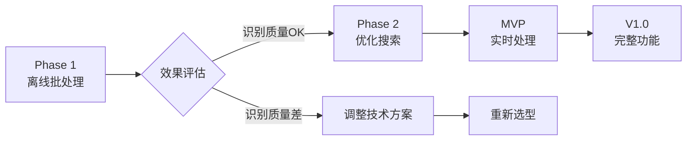

# Phase 1 设计决策文档

## 📋 审查者反馈总结与回应

### 1. 识别准确率与演进目标
**反馈：** 95%准确率目标过于乐观，缺乏数据支撑
**我们的立场：** 在原型阶段不追求高准确率
**Phase 1决策：** 
- 设定务实目标：使用SigLIP多语言分类，大类识别80-85%
- 重点验证技术可行性和多语言支持能力
- 通过实际数据验证，再调整目标

### 2. 时延与吞吐指标  
**反馈：** "1秒缩略图+2秒分类"在CPU上难以达成
**我们的立场：** 性能不是当前重点
**Phase 1决策：**
- 采用离线批处理，不追求实时性
- 用户可以等待，重点是功能正确
- 批处理速度10-20张/分钟即可接受

### 3. 品牌/型号识别链路
**反馈：** 缺乏具体实现方案和数据源
**我们的立场：** 暂时无法评估其必要性
**Phase 1决策：**
- 暂不实现品牌/型号细分识别
- 专注于大类识别（电子产品/美食/文档）
- 收集用户反馈后再决定是否需要

### 4. Few-shot学习
**反馈：** CPU环境下难以达到效果，需要评估机制
**我们的立场：** 原型阶段不需要此功能
**Phase 1决策：**
- 完全不实现Few-shot学习
- 先验证基础识别质量
- 后续版本再考虑个性化学习

### 5. 存储与检索
**反馈：** SQLite + LIKE难以满足复杂搜索需求
**我们的立场：** 需要评估建议的有效性
**Phase 1决策：**
- 先用SQLite全文搜索验证基本功能
- 不引入向量数据库增加复杂度
- 如果搜索效果不佳，再考虑升级

### 6. 系统复杂度 ⭐
**反馈：** 设计过于庞大，容易失控
**我们的立场：** **完全认同这个担忧**
**Phase 1决策：**
- 大幅简化架构，单体应用
- 最少依赖，避免技术债务
- 每个组件都必须证明其价值

## 🎯 Phase 1 核心设计理念

### 原则1：验证优先于优化
```
不追求：性能指标、识别精度、用户体验完美
追求的：功能可用、技术可行、易于迭代
```

### 原则2：简单优先于完善
```
选择简单方案：
- SQLite而非PostgreSQL
- 全文搜索而非向量搜索  
- 批处理而非实时处理
- Streamlit而非React
```

### 原则3：减法优先于加法
```
砍掉的功能：
- ❌ Few-shot学习
- ❌ 品牌型号识别
- ❌ 实时处理
- ❌ 向量搜索
- ❌ 用户系统
```

## 📊 Phase 1 vs Phase Final原设计对比

| 方面 | Phase Final原设计 | Phase 1简化版 | 简化原因 |
|------|----------|------------|----------|
| 处理模式 | 实时+异步 | 纯离线批处理 | 降低复杂度 |
| 识别引擎 | 多模型组合 | SigLIP+BLIP | 无依赖问题，多语言支持 |
| 识别层次 | 大类→子类→型号 | 仅大类+描述 | 验证核心功能 |
| 搜索方式 | 文本+向量混合 | 仅SQL全文搜索 | 避免过早优化 |
| 学习能力 | Few-shot个性化 | 无 | 超出PoC范围 |
| 数据库 | PostgreSQL+向量库 | SQLite | 零配置部署 |
| UI框架 | React全功能 | Streamlit最简 | 快速原型 |
| 部署方式 | 容器化微服务 | 单机脚本 | 简化运维 |

## 🚀 Phase 1 成功标准（调整后）

### 必须验证
1. **批处理流程** - 能处理100+张图片不崩溃
2. **识别可用性** - 使用SigLIP进行多语言分类（>80%准确率）
3. **图像理解** - 使用BLIP生成描述，能理解图像内容
4. **OCR功能** - 能提取中英文文本
5. **搜索功能** - 能通过关键词找到图片

### 不需要验证
1. ~~高精度识别（95%）~~
2. ~~实时响应（<1秒）~~
3. ~~品牌型号识别~~
4. ~~个性化学习~~
5. ~~生产级稳定性~~

## 📈 风险控制策略

### 已识别风险及缓解

| 风险 | 概率 | 影响 | 缓解策略 |
|------|------|------|----------|
| 识别效果太差 | 中 | 高 | 调整为仅验证大类，降低期望 |
| 开发超时 | 低 | 中 | 功能极简，14天可完成 |
| 技术障碍 | 低 | 高 | 选择成熟方案，有备选 |
| 用户不满意 | 中 | 低 | 明确是PoC，管理预期 |

## 🎬 后续路线图



## 📝 关键决策记录

### ⚠️ 重要更新：技术选型变更（2024-11）
**从RTMDet迁移到SigLIP+BLIP**
- **触发原因：** RTMDet的mmcv依赖无法在Python 3.11+安装
- **变更时间：** 2024-11-12
- **主要改进：**
  - ✅ 解决了依赖地狱问题
  - ✅ 新增多语言支持（18+语言）
  - ✅ 新增图像描述生成能力
  - ✅ 保持了高准确率（~85%）
- **影响：** 模型大小增加但功能更强大，更易维护

### 决策1：采用离线批处理架构
- **时间：** 2024-11-XX
- **原因：** 降低系统复杂度，专注验证识别质量
- **影响：** 用户体验降级但可接受
- **替代方案：** 如效果好，Phase 2再加入实时处理

### 决策2：不实现Few-shot学习
- **时间：** 2024-11-XX  
- **原因：** 增加不必要的复杂度，原型阶段不需要
- **影响：** 无法识别特殊产品
- **替代方案：** 收集需求后，V2再考虑

### 决策3：使用SQLite + 全文搜索
- **时间：** 2024-11-XX
- **原因：** 最简单的方案，足够验证
- **影响：** 搜索能力受限
- **替代方案：** 如不够用，逐步升级到PostgreSQL

### 决策4：使用SigLIP+BLIP作为主要识别引擎
- **时间：** 2024-11-XX  
- **原因：** 
  - **无依赖地狱** - RTMDet的mmcv无法在Python 3.11+安装
  - **多语言支持** - SigLIP原生支持中文、英文、日文等18+语言（~85%准确率）
  - **零样本学习** - 无需预定义类别，灵活性更高
  - **图像理解** - BLIP可生成自然语言描述，不仅仅是分类
  - **更好维护** - 基于活跃的Hugging Face生态系统
- **影响：** 模型稍大（~1.4GB），但功能更强大
- **替代方案：** 已废弃RTMDet（依赖问题严重），不再考虑旧版CLIP（功能不足）

## ✅ 总结

Phase 1的设计充分考虑了审查者的反馈，特别是关于系统复杂度的担忧。我们采取了**极简主义**的方法：

1. **聚焦核心** - 只验证最关键的识别和搜索功能
2. **降低复杂度** - 能砍的功能都砍掉
3. **快速迭代** - 2周交付，快速获得反馈
4. **务实目标** - 不追求完美，只求可用

这种方法能让我们：
- 快速验证技术可行性
- 避免过度设计
- 基于实际效果做决策
- 保持架构简单易改

**下一步：** 开始Phase 1开发，用最简单的方式验证核心价值。
